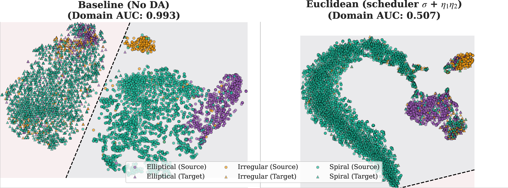

Domain Adaptation In Galaxy Morphology
======================================

Domain Adaptation for Galaxy Morphology Classification using llustrisTNG and Galaxy Zoo Evolution dataset


## Abstract

Large photometric surveys will image billions of galaxies, but we currently lack quick, reliable automated ways to infer their physical properties like morphology, stellar mass, and star formation rates. Simulations provide galaxy images with ground-truth physical labels, but domain shifts in PSF, noise, backgrounds, selection, and label priors degrade transfer to real surveys. We present a preliminary domain adaptation pipeline that trains on simulated TNG50 galaxies and evaluates on real SDSS galaxies with morphology labels (elliptical/spiral/irregular). We train three backbones (CNN, $E(2)$-steerable CNN, ResNet-18) with focal loss and effective-number class weighting, and a feature-level domain loss $\mathcal{L}_D$ built from [GeomLoss](./geomloss/) (entropic Sinkhorn OT, energy distance, Gaussian MMD, and related metrics). We show that a combination of these losses with an OT-based “top-$k$ soft matching’’ loss that focuses $\mathcal{L}_D$ on the worst-matched source–target pairs can further enhance domain alignment. With Euclidean distance, scheduled alignment weights, and top-$k$ matching, target accuracy rises from ~61% (no adaptation) to ~86–89%, with a ~17-point gain in macro–F1 and a domain AUC near 0.5, indicating strong latent-space mixing.



## Prerequisites

- Python 3.10 or higher
- [`uv`](https://docs.astral.sh/uv/getting-started/installation/) package manager

## Installation

1. Clone this [`repo`](https://github.com/ahmedsalim3/galaxy-da.git)

```bash
git clone https://github.com/ahmedsalim3/galaxy-da.git
```

2. Install dependencies:

```bash
make install
```

- or you can create a `.venv`:

```sh
python3 -m venv .venv
source .venv/bin/activate # On mac/linux distros
```
- Install `nebula`

```sh
pip install -e .
```

## Data

To access the datasets used in this project, please refer to the [Zenodo dataset repository](https://zenodo.org/records/17434016). The dataset includes RGB galaxy images and labels for both source (IllustrisTNG) and target (SDSS, Galaxy Zoo 2) domains.

## How to train?

1. Create a config file, see [template](./configs/config.template.yml) and run with 

```sh
python3 scripts/run_train.py --config /path/to/config.yml
```

## How to evaluate?

```sh
python3 scripts/run_eval.py /path/to/ckpt
```
You can also run train and evaluate simultaneously. Run this with a single config, multiple configs, or a folder of configs by passing `-f`:

```sh
./run_experiment.sh <config_path> [more_configs...]
# or for a folder of configs:
./run_experiment.sh -f <config_folder>
```

## Experiments

The [experiments](./experiments/) directory contains the paper experiments. For other experiments, checkout to the [distance-metrics branch](https://github.com/ahmedsalim3/galaxy-da/tree/distancemetrics_branch) or [ot-alignment](https://github.com/ahmedsalim3/galaxy-da/tree/ot-alignment) branch:

## About This Project

This project was made possible through the [2025 IAIFI Summer School](https://github.com/iaifi/summer-school-2025) provided by The [NSF AI](https://iaifi.org/) Institute for Artificial Intelligence and Fundamental Interactions (IAIFI). This work was presented at the Machine Learning and the Physical Sciences Workshop @ [NeurIPS 2025](https://neurips.cc/)
