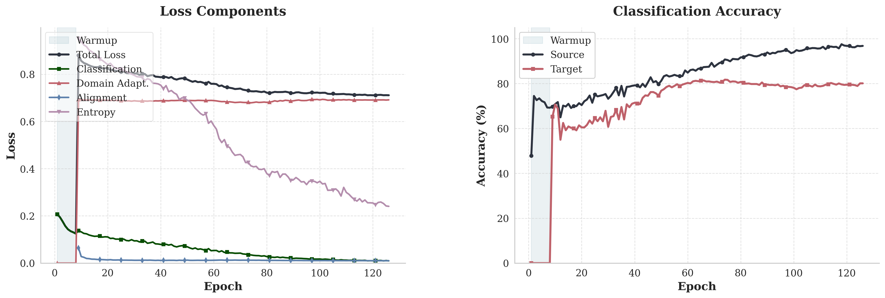
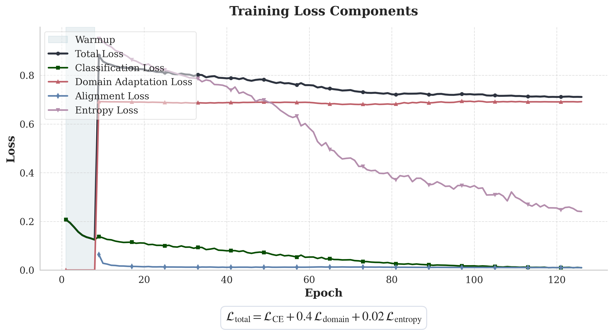
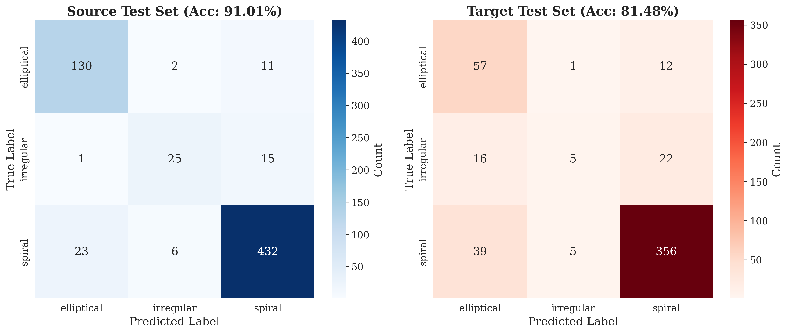
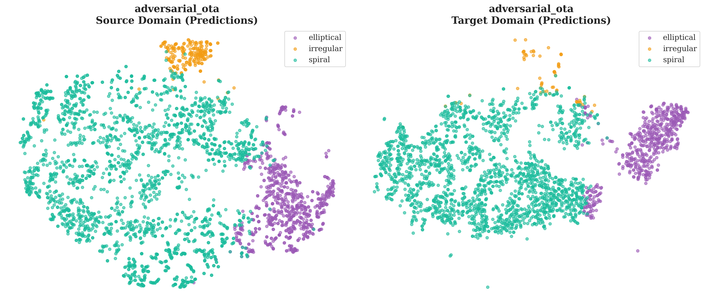
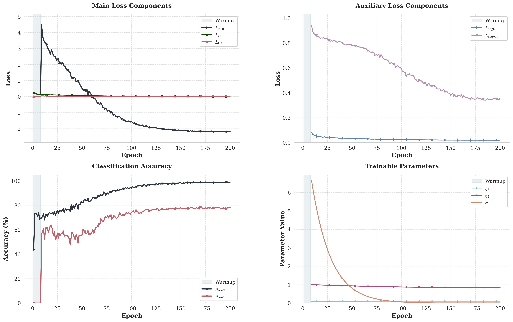
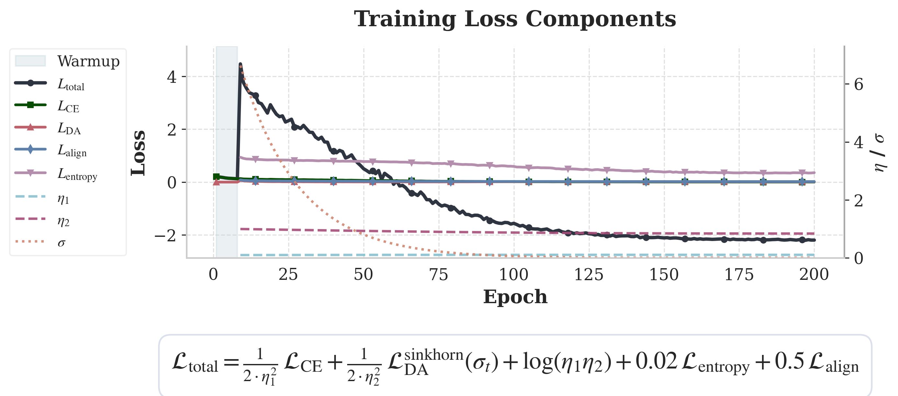
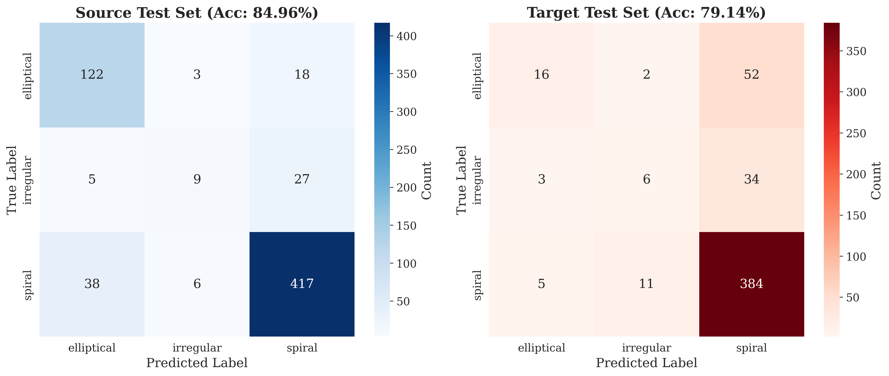
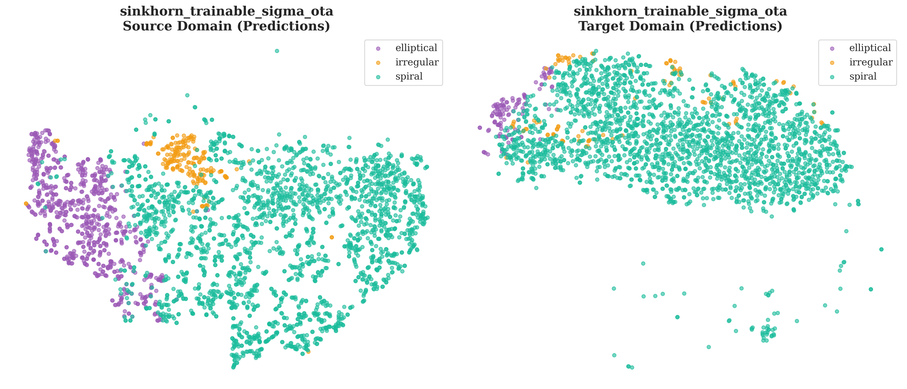

# Experiments Summary

Domain adaptation experiments for galaxy morphology classification (source: TNG50 simulated, target: Galaxy Zoo 2 real images).

## Target Domain Performance

| Experiment | Target Acc | Target F1 | Target ROC-AUC | Target AUPRC | Target ECE | Source Acc | Source F1 | Domain AUC |
|---|---|---|---|---|---|---|---|---|
| adversarial_ota | **81.5%** | **0.571** | **0.779** | 0.586 | 0.1082 | 91.0% | 0.830 | 0.8181 |
| sinkhorn_trainable_sigma_ota | 79.1% | 0.472 | 0.756 | 0.544 | 0.0934 | 85.0% | 0.667 | 0.7767 |

## Target Domain Class Recall

| Experiment | Class 1 Recall | Class 2 Recall | Class 3 Recall |
|---|---|---|---|
| adversarial_ota | 81.4% | 11.6% | 89.0% |
| sinkhorn_trainable_sigma_ota | 22.9% | 14.0% | 96.0% |

## Some Results

### `adversarial_ota` | Adversarial - ESCNN (E2) | [Config File](./adversarial_ota/ckpts/adversarial_ota.yml)

-------------------------------

### `sinkhorn_trainable_sigma_ota` | Sinkhorn - ESCNN (E2) | [Config File](./sinkhorn_trainable_sigma_ota/ckpts/sinkhorn_trainable_sigma_ota.yml)

