# Experiments Summary

Domain adaptation experiments for galaxy morphology classification (source: TNG50 simulated, target: Galaxy Zoo 2 real images).

## Target Domain Performance

| Experiment | Target Acc | Target F1 | Target ROC-AUC | Target AUPRC | Target ECE | Source Acc | Source F1 | Domain AUC |
|---|---|---|---|---|---|---|---|---|
| resnet_energy_trainable_ota | **87.9%** | **0.627** | 0.831 | 0.605 | 0.1088 | 87.8% | 0.686 | 0.5072 |
| resnet_mmd_fixed_lambda_ota | 85.8% | 0.613 | 0.873 | 0.642 | 0.1235 | 84.8% | 0.655 | 0.5796 |
| resnet_sinkhorn_fixed_lambda_ota | 87.5% | 0.621 | **0.881** | 0.692 | 0.0978 | 85.4% | 0.680 | 0.5829 |
| resnet_sinkhorn_trainable_sigma_ota | 84.8% | 0.583 | 0.820 | 0.651 | 0.1129 | 85.4% | 0.659 | 0.7267 |

## Target Domain Class Recall

| Experiment | Class 1 Recall | Class 2 Recall | Class 3 Recall |
|---|---|---|---|
| resnet_energy_trainable_ota | 100.0% | 9.3% | 94.2% |
| resnet_mmd_fixed_lambda_ota | 100.0% | 9.3% | 91.5% |
| resnet_sinkhorn_fixed_lambda_ota | 92.9% | 9.3% | 95.0% |
| resnet_sinkhorn_trainable_sigma_ota | 100.0% | 4.7% | 90.8% |

## Some Results

### `resnet_energy_trainable_ota` | Energy - resnet18 (pretrained) | [Config File](./resnet_energy_trainable_ota/ckpts/resnet_energy_trainable_ota.yml)

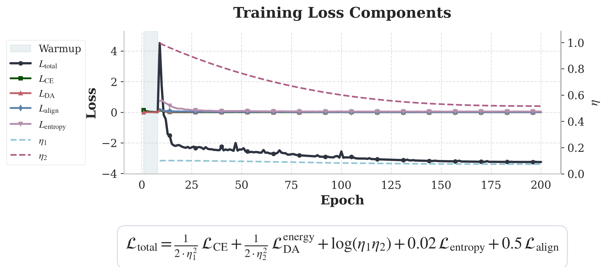

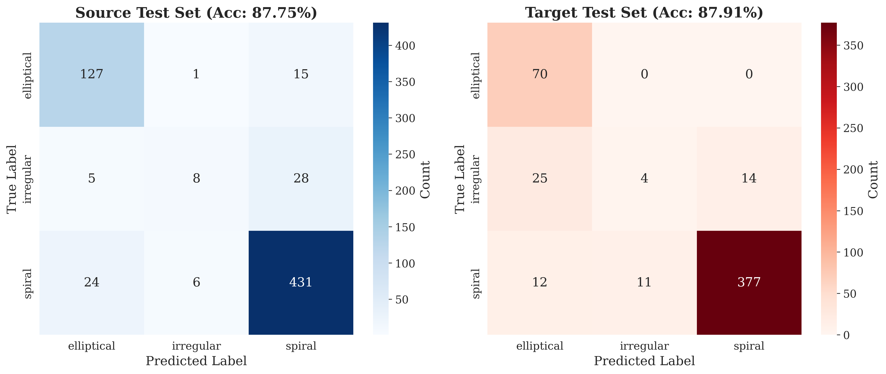

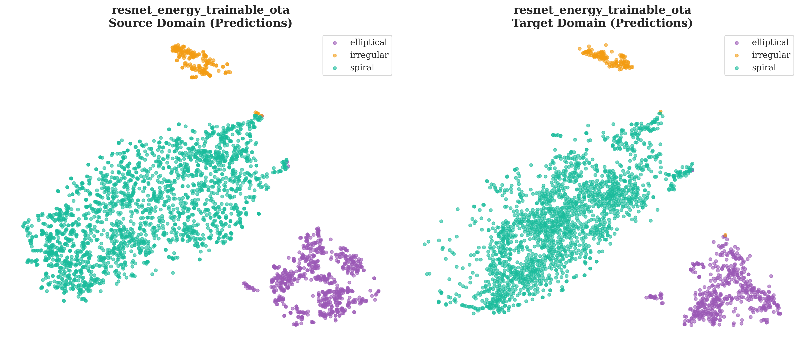

-------------------------------

### `resnet_mmd_fixed_lambda_ota` | Mmd - resnet18 (pretrained) | [Config File](./resnet_mmd_fixed_lambda_ota/ckpts/resnet_mmd_fixed_lambda_ota.yml)

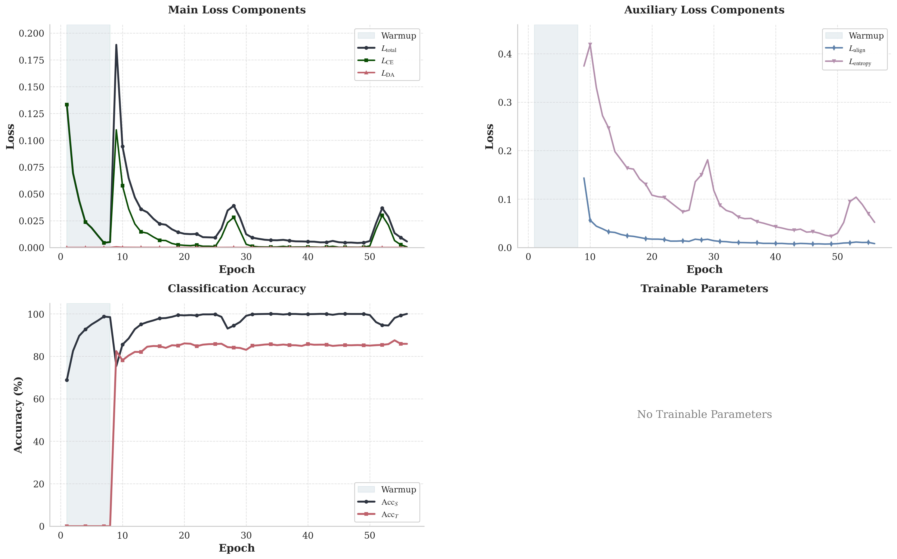

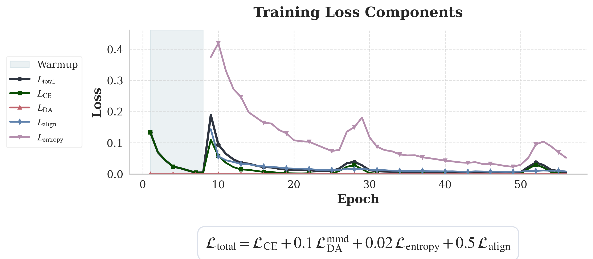

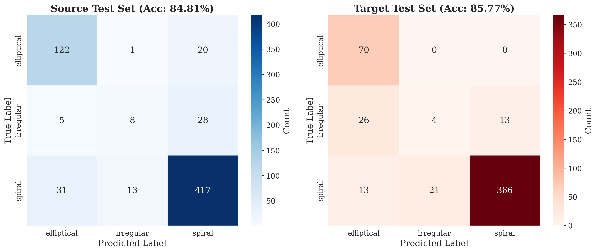

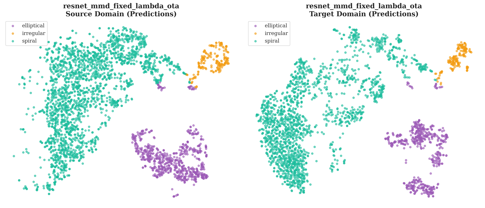

-------------------------------

### `resnet_sinkhorn_fixed_lambda_ota` | Sinkhorn - resnet18 (pretrained) | [Config File](./resnet_sinkhorn_fixed_lambda_ota/ckpts/resnet_sinkhorn_fixed_lambda_ota.yml)

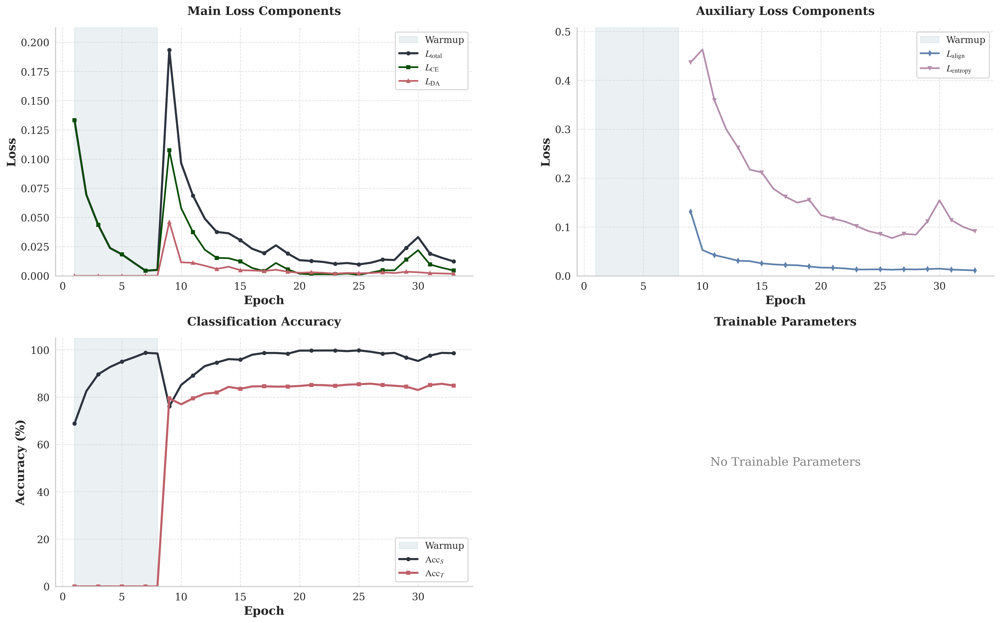

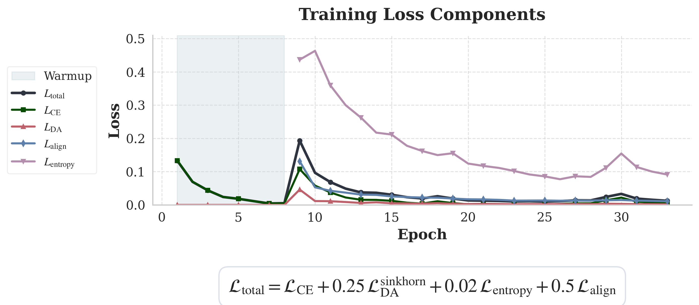

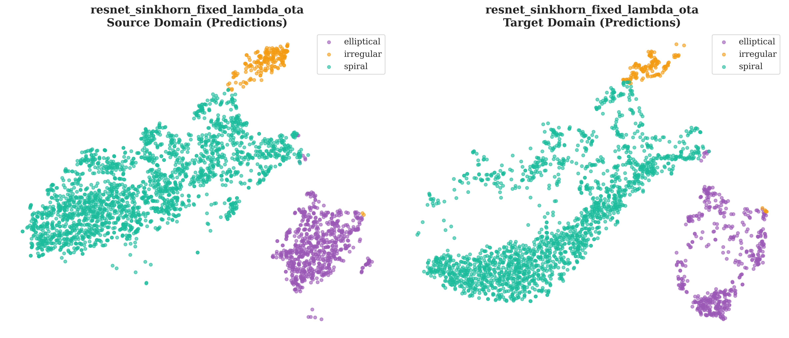

-------------------------------

### `resnet_sinkhorn_trainable_sigma_ota` | Sinkhorn - resnet18 (pretrained) | [Config File](./resnet_sinkhorn_trainable_sigma_ota/ckpts/resnet_sinkhorn_trainable_sigma_ota.yml)

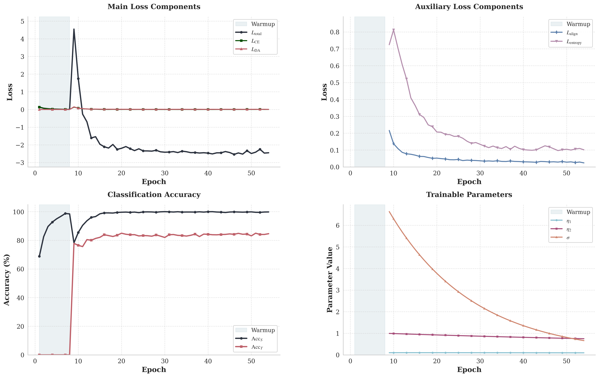

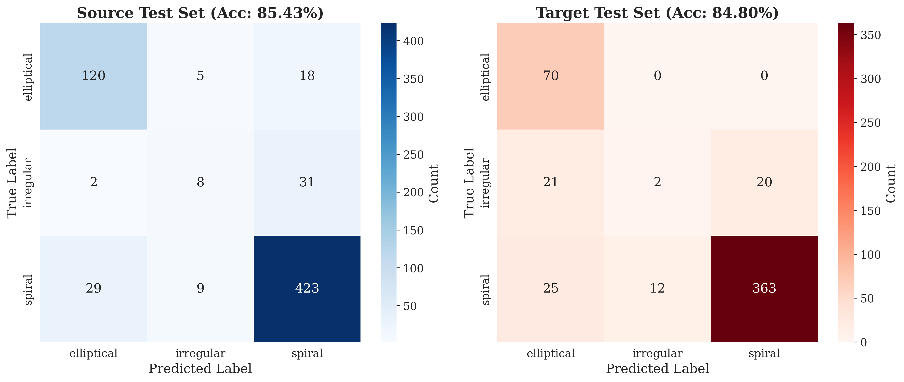

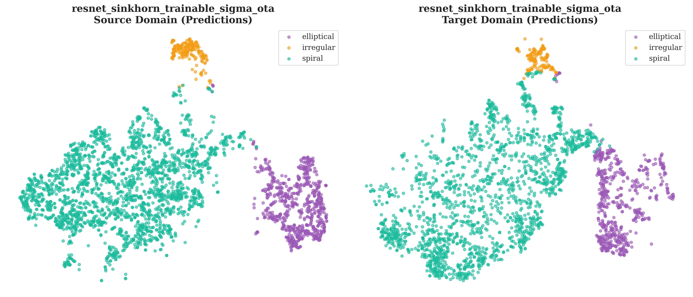
